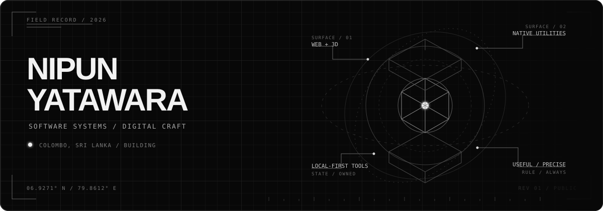

  

  <a href="https://www.shocka.site"><code>PORTFOLIO</code></a>&nbsp;&nbsp;
  <a href="https://www.linkedin.com/in/nipun-yatawara"><code>LINKEDIN</code></a>&nbsp;&nbsp;
  <a href="mailto:nipunyatawara.dev@gmail.com"><code>EMAIL</code></a>

### `FIELD NOTE / 01`

I like software with a physical edge: menu bar tools, system tray utilities, local-first workspaces, and interfaces that make difficult subjects feel tangible. I build for the browser when it is the right surface, and closer to the operating system when it isn't.

Software engineering undergraduate in Colombo, Sri Lanka. Currently working across TypeScript, React, Next.js, Swift, Python, and C#.

### `SYSTEM INDEX / 07`

<table>
  <tr>
    <td width="13%"><code>WEB·3D 001</code></td>
    <td width="62%"><strong>Atomic Atelier</strong> All 118 elements explored through 3D atomic models, trends, quizzes, comparisons, and a guided reaction lab.</td>
    <td width="25%" align="right"><a href="https://atomic-atelier.vercel.app/">RUN ↗</a> <a href="https://github.com/nipunyatawara-dev/Atomic-Atelier">SOURCE ↗</a></td>
  </tr>
  <tr>
    <td><code>LOCAL 002</code></td>
    <td><strong>BillCraft</strong> A local-first invoice workspace for freelancers and small teams. Clients, tracking, analytics, and exports stay together.</td>
    <td align="right"><a href="https://github.com/nipunyatawara-dev/Billcraft-invoice-manager">SOURCE ↗</a></td>
  </tr>
  <tr>
    <td><code>INDEX 003</code></td>
    <td><strong>Random Stuff</strong> A maintained field guide to useful, strange, and interesting websites, tools, and scripts.</td>
    <td align="right"><a href="https://randomstuff.shocka.site/">OPEN ↗</a> <a href="https://github.com/nipunyatawara-dev/random-stuff-site">SOURCE ↗</a></td>
  </tr>
  <tr>
    <td><code>DESKTOP 004</code></td>
    <td><strong>OmniSync</strong> A workspace launcher and sync dashboard for repositories that live locally and on GitHub.</td>
    <td align="right"><a href="https://omnisync-desktop.vercel.app/">OPEN ↗</a> <a href="https://github.com/nipunyatawara-dev/OmniSync">SOURCE ↗</a></td>
  </tr>
  <tr>
    <td><code>MACOS 005</code></td>
    <td><strong>NetCollect</strong> Per-app network usage, live bandwidth, historical charts, and local SQLite storage for macOS.</td>
    <td align="right"><a href="https://github.com/nipunyatawara-dev/NetCollect">SOURCE ↗</a></td>
  </tr>
  <tr>
    <td><code>MACOS 006</code></td>
    <td><strong>HiDPI Toggle</strong> A tiny menu bar utility that unlocks HiDPI and Retina scaling on external displays.</td>
    <td align="right"><a href="https://github.com/nipunyatawara-dev/HiDPI-Toggle">SOURCE ↗</a></td>
  </tr>
  <tr>
    <td><code>WINDOWS 007</code></td>
    <td><strong>PowerPlan Switcher</strong> Instant power-plan switching from a compact interface or the Windows system tray.</td>
    <td align="right"><a href="https://github.com/nipunyatawara-dev/windows-powerplan-switcher">SOURCE ↗</a></td>
  </tr>
</table>

### `WORKING SET`

`TypeScript` · `React` · `Next.js` · `Swift` · `Python` · `C#` · `Tailwind CSS` · `Git`

The complete archive, case studies, and earlier creative work live at <a href="https://www.shocka.site">shocka.site</a>.

<!-- Add future featured projects to the system index above this line. -->
